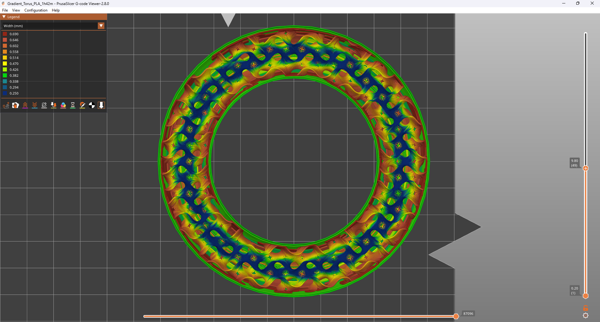
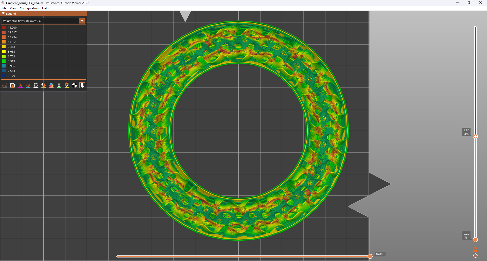
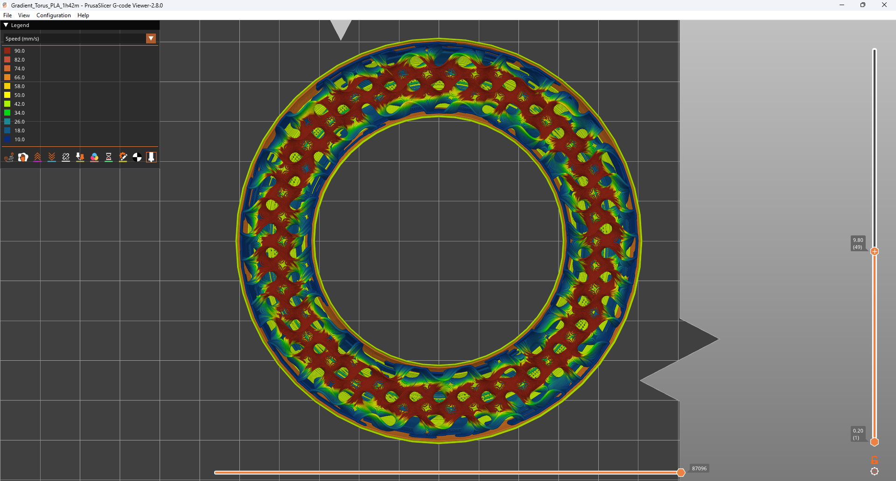
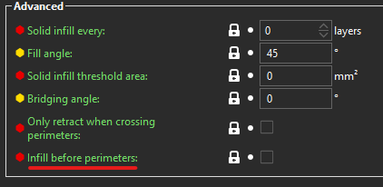

# Gradientinfill for Orca, Bambu, Prusa and Cura slicer:
If you are running the script from the slicer there will be just one output file. I recommend testing the script first inside of an IDE and compare the original and modified file.

The following part was originally written as a [guide for prusa slicer](https://github.com/WatchingWatches/GradientInfill/tree/master/Prusa), but the slicer settings are the same, but might be found at a different location with a slightly different name.

## Introduction what changed?:
This is a fork of the repository of CNC-Kitchen. I didn't change the working principal of the script. I mainly adapted the comments within the gcode file to suit those generated by Orca, Bambu and Prusa slicer and changed a few things which resulted in errors previously (used re patterns instead of searching for single characters in line).
I implemented an volumetric flow limit which is currently in the beta phase. The script can recognize, which slicer generated the gcode and works with Orca, Bambu, Prusa and Cura slicer. There is also a option to reduce the line width in the core with ``THIN_INNER_CORE: bool = True``.
To understand better how the script works, i recommend watching the YouTube video and reading the README.md in the main folder. There you can also find instructions to install python (I'm using python 3.9.18 with the anaconda distribution).

### Example:
In the pictures you can see the change in line width, which was the original function. When you increase the line width, but don't change the print speed you will increase the volumetric flow, which can be too much for your hotend. I implemented a flow limit, which decreases the printing speed when the flow is getting too much (15 mm^3/s in the example).

It's difficult to see the different line width of the infill on the picture. The test piece also needs to be large enough.

## Features:
- The script can be called directly after slicing with an optional dialog in the terminal, which will automatically open (``run_in_slicer = True``)
- It's also possible to run the script inside of an IDE (``run_in_slicer = False``)
- If the script didn't do any changes it will print a message. This means something went wrong.
- If a bug occurs the error message will be written inside of the terminal. When this happens please review, that all of the entered settings are correct. Open an issue here at this repository and share your gcode and/or 3mf file with settings and the error message to get help.

## Slicer settings (enable advanced mode):
Without these slicer settings the script will not work.

### Disable Arc fitting in print settings-> advanced:

### Use relative extrusion in printer settings-> general:

### Infill before perimeter need to be turned off printer settings-> infill:

### Wipe while retracting must be disabled:
printer settings -> extruder -> retraction

Also ensure, that the filament override is disabled.

### Automatically call script when saving the file:

Insert the path to your python.exe followed by the path to the python script in print settings -> output options.

## Running script:
The script gets called after the slicing process. 
This means, that the preview inside of the slicer doesn't show the changes of the script.

### Investigate the modified gcode (recommended):
The following steps are recommended and should be performed every time, until you trust the script. There might be errors specific to your gcode, which i haven't thought of. Those could potentially damage your printer.

Open the file inside of a gcode viewer (drag the gcode file into a slicer/gcode previewer [Prusa works well]), to take a look at the modified gcode. Select the line width color scheme to see the difference. 
Open the two files inside of notepad++ and compare both files with a plugin called "compare". The program will mark all of the changes in between both files. This is the safest check, since the gcode previewer can give a wrong impression (use a small file).

## General advice:
Experiment with the different parameters. For me a ``MAX_FLOW = 350`` was set too high and 250 worked better.

Print small test pieces to test your settings. The test pieces don't need to be tall, but the infill section needs to be large enough, so you can actually see the difference in line width.
You may need to lower the infill speed, since the flow increases with the use of the script (the volumetric flow limit within the script can makes this step obsolete if it works correctly).
Check in the preview, that it's not exceeding the maximum flow of the hotend. The line width of the infill shouldn't be much higher than the nozzle diameter in the slicer setting.

When you look at the second picture you can see that the flow in the inner core (outside of the ``GRADIENT_THICKNESS`` range) isn't changed. If you want a thin infill width in the core (where the forces are the lowest) you can enable ``THIN_INNER_CORE: bool = True``.

If you modify a big file the computing time can be several minutes long.
I tried adding a progress bar, but it nearly doubled the execution time, so i removed it.

## Personal recommendation:
You can decrease the run time by using a special interpreter called pypy. For large files it decreased the run time by x7 (may differ on your machine). [Here is an installation guide.](https://doc.pypy.org/en/latest/install.html)

## Prospect for the future:
I will try to optimize the calculation time of the script.
With your help i will debug the script for errors, which might occur.
The next step will be adding an automatic infill pattern recognition.

You may also be interested in [my own postprocessing scripts.](https://github.com/WatchingWatches/Post_processing_gcode).

Thank you for you feedback in advance. Also feel free to adapt the script to other slicers too.